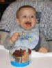

::: image-right

:::

Almost exactly year ago, my life was changed forever by the
[arrival](http://devhawk.net/2003/02/23/welcome-patrick/)
of my son Patrick. I tried to approach my imending fatherhood with an
open mind, realizing that my life was going to change but not really
sure exactly how. So far, I think I’m doing pretty well. Today, Patrick
is walking (in spurts), talking (in gibberish mostly), eating solid
foods and otherwise making everyone around him smile. I don’t write as
much code, play as much XBOX or read for fun as much as I used to, but I
do seem to smile a lot more.

I am truly blessed to have such an amazing
[wife](http://techiewife.com/), son and job.
