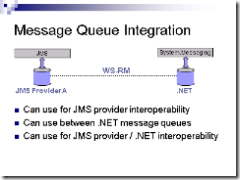

*(Harry is on a secret mission in uncharted space this week, so instead
of the daily Morning Coffee post, you get a series of autoposted essays.
This post builds on Harry’s [recent
epiphany](http://devhawk.net/2007/02/06/how-i-learned-to-stop-worrying-and-love-wcf/)
about WCF and long running services)*

Way, way, *way* back in March of 2003, IBM and Microsoft published an
“overview and roadmap” white paper entitled “[Reliable Message Delivery
in a Web Services
World](http://msdn2.microsoft.com/en-us/library/ms951247.aspx)“. It
contained the following paragraph under the section “Exchanging Messages
Reliably”:

> WS-ReliableMessaging is not bound to underlying transport protocols or
> sessions. ***This means that the lifetime of a WS-ReliableMessaging
> conversation can span long periods of time (days, weeks) even when one
> or both systems are rebooted.*** This allows conversations to be
> suspended mid-stream (for example, to allow system maintenance) and
> then resumed without needing to retransmit the entire conversation.
> [emphasis added]

Now I know how I got [confused about WCF and long running
services](http://devhawk.net/2007/02/06/how-i-learned-to-stop-worrying-and-love-wcf/)
in the first place. *Support for long running services was part of the
original web services vision!*

About three years after that white paper was published, Shy Cohen wrote
a post entitled [Reliable Messaging
Demystified](http://blogs.msdn.com/shycohen/archive/2006/02/20/535717.aspx)
on his blog. Shy was at one time the feature owner of WS-RM in WCF
(according to his post) and wrote the following:

> Reliable sessions [in WCF] are implemented using the
> WS-ReliableMessaging protocol. This protocol is yet another misnamed
> WS-\* protocol, as it actually only deals with the reliability of the
> transfer and says nothing about durability, delivery acknowledgments,
> TTL for a message, long running sessions where a particular message is
> lost forever, etc.

At some point in the three years between March 2003 and February 2006,
WS-RM went from being the enabler of long running services to “yet
another misnamed WS-\* protocol”. And with it, WCF lost (never had?) the
ability to support long running services (as I’ve [written
previously](http://devhawk.net/2006/10/28/is-wcf-straightforward-for-long-running-tasks/)).

Now all and all, this isn’t a big deal. I agree with Shy that WS-RM is
under specified as mechanism for durable messaging (Shy calls this
“queued messaging”). Attempting to build durable messaging on top of
WS-RM sounds like it would have been both difficult and unlike to
broadly interoperate. So implementing WS-RM for TCP style reliability
and leveraging MSMQ as a transport for people that need durable
messaging sounds like a pretty good compromise, especially for a v1
product. Of course, it is not exactly unheard of for a project’s end
result not to completely live up to the original vision. But I have a
specific requirements in this case, so I wanted to know more.

::: image-right

:::

By calling it “misnamed”, it sounds like WS-RM was never really intended
to be used for durable messaging. However, the July 2003 [Reliable
Messaging Feedback
Workshop](http://msdn2.microsoft.com/en-us/webservices/aa740628.aspx)
indicates that it was. In particular, Rodney Limprecht’s [“Reliable
Messaging Scenarios”
deck](http://download.microsoft.com/download/6/d/4/6d48120a-878e-4f0d-af20-3e900b004c3d/presentations-july2003-ws-wkshp.zip)
describes WS-RM as supporting scenarios requiring “either volatile or
durable endpoint state”. His list of scenarios included both an
“Intermittent Connectivity” scenario where “messages pending transfer
are staged to disk and exchanged when connected” as well as a “Message
Queue Integration” scenario that used WS-RM to interop between
[JMS](http://java.sun.com/products/jms/) and MSMQ. Seems safe to say
that WS-RM was originally intended to support durable messaging. So what
happened? How did it become “misnamed”?

Rodney’s deck describes WS-RM as having the “flexibility to meet
scenario requirements”. But flexibility comes at a cost. For example,
the flexibility of WCF’s configuration comes at the cost of [significant
complexity](http://www.winterdom.com/weblog/2007/02/12/WCFConfigurationComplexity.aspx).
In the case of WS-RM, it appears that by trying to make it flexible
enough to support both volatile and durable reliability, the authors
might have made it *too* flexible. WS-RM implementers have broad
latitude in building the capabilities Shy mentions (durability,
acknowledgements, TTL, etc) as well as describing said capabilities in
policy. By providing that latitude, we lost the ability to broadly
interop durable messaging, which I would suspect is why it ended up out
of scope for WCF v1.

As I said before, lack of support for WS-RM based durable messaging
isn’t that big a deal. As long as you understand [WCF’s sweet
spot](http://devhawk.net/2007/02/06/how-i-learned-to-stop-worrying-and-love-wcf/) -
the current version’s sweet spot anyway – and don’t try and make it be
something it’s not, you should be fine. Furthermore, Shy mentions the
need for an “interoperable Queued Messaging specification” and wrote
that it’s something he “expect[s] that we will get to it in the near
future”. Here’s hoping that spec is less flexible than
WS-ReliableMessaging.
