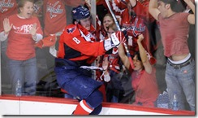

OK, I’ll admit it. When the Caps were down 4-2 after two I started
having, you know, unsure thoughts. Thoughts like:

“We should be proud to have even made the playoffs”.

“It’s a young team, they’re just getting started, this year doesn’t
matter much”.

Oh me of little faith.
:smile:

::: image-right

:::

Caps [took game
one](http://www.nhl.com/nhl/app?service=page&page=Recap&gameNumber=131&season=20072008&gameType=3)
of their best-of-seven series with the Flyers in fairly dramatic
fashion, scoring three goals in the third period, including a nifty
steal by Ovechkin for the game winner. Game winning goal, assist and
eight hits on a supposedly more physical team == quite a first playoff
game for Alex the Great.

I’m sure folks that more regularly blog the Caps than I do will recap
the game better than I will. Peerless Prognosticator [already
has](http://peerlessprognosticator.blogspot.com/2008/04/caps-win-caps-win-caps-win-caps-5.html)
and I’m sure [Japers](http://japersrink.blogspot.com/) will by tomorrow.
But here are a few of my thoughts.

-   The
    [stats](http://www.nhl.com/scores/htmlreports/20072008/ES030131.HTM)
    say we did well in the faceoff circle, winning 58% (36 of 62).
    However, their first goal was scored when the Flyers got a clean
    faceoff win in our end, so I was acutely attuned to every faceoff
    loss from that point forward. My gut impression was that we hadn’t
    done as well as we did.
-   Remember, I don’t get to see the Caps very often. So it was kinda
    surreal to see a Caps team able to cycle the puck down low so well.
    The Flyers seems fairly helpless to stop us.
-   On the other hand, we didn’t seem to do so well getting the puck out
    of our own zone. On Philly’s second goal, we managed to get it out
    of the zone, but turned it over in the neutral zone which lead to a
    3-on-2.
-   With the exception of the second half of the second (where the
    Flyers scored three times in under four minutes), I thought the Caps
    out played the Flyers most of the way. The third period was
    especially good for the Caps. Not only did they score three, the
    held the Flyers to a mere three shots, and NONE after Ovechkin
    scored what turned out to be the game winner. My mom always says a
    two goal lead is the most dangerous lead in hockey. that sure was
    true tonight.
-   Both Ovechkin and Brashear showed great patience on their goals.
    There’s a [great
    picture](http://www.ericmcerlain.com/offwingopinion/archives/008335.php#008335)
    of Ovechkin waiting for Biron to commit over @ Off Wing Opinion.
-   The refs pretty much let them skate. There was what I thought was a
    missed tripping call at one point and my brother pointed out
    Richards was standing in Huet’s way in the crease on Briere’s second
    goal, but frankly it was such a pretty pass I doubt Huet could have
    gotten it. Caps do need to do a better job clearing their crease.
-   There’s a bit of a controversy surrounding the Caps’ fourth goal.
    The Caps were on the power play and Green unleashed a shot that [hit
    Flyer’s winger Thoresen in the
    groin](http://sports.espn.go.com/nhl/news/story?id=3342832). The
    refs didn’t whistle the play dead and the Caps scored while Thoresen
    writhed on the ice in pain. Apparently, the rules are that you don’t
    blow the whistle unless the player’s life is in danger, so it looks
    like a good non-call. But I’m guessing Philly fan doesn’t agree.

Game two, Sunday 2pm Eastern/11am Pacific. You’ll know where I’ll be.
