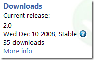

::: image-left
 
:::

This is a very pretty sight. It’s a screenshot from the IronPython CodePlex
home page showing that 2.0 is the “current release”. Yes that’s right,
dear reader, IronPython 2.0 has officially been released!

[Get it
now](http://www.codeplex.com/IronPython/Release/ProjectReleases.aspx?ReleaseId=8365)!

This release marks the end of a very busy year for me, nine months to
the day since I accepted the offer to [join the dynamic languages
team](http://devhawk.net/2008/03/11/joining-the-dynamic-languages-team/).
Between helping ship IronPython 2.0 and helping manage the languages and
tools PDC08 track, I’ve been swimming in the deep end of the pool all
year. Feels good to *not* have any immediate deliverables for the next
month or two.

Major, *major* props to [Dino](http://blogs.msdn.com/dinoviehland),
[IronCurt](http://blogs.msdn.com/curth),
[Dave](http://knowbody.livejournal.com/) and
[Srivatsn](http://blogs.msdn.com/srivatsn) who have done the heavy
lifting on the IPy side this release. Also major props to the DLR team,
who are releasing the final 0.9 version of the DLR later today in
concert with IPy 2.0. (Update: the [DLR 0.9 RTW
bits](http://www.codeplex.com/dlr/Release/ProjectReleases.aspx?ReleaseId=20378)
are now available) And of course, HUGE HUGE HUGE thanks to the vibrant
IPy community, many of whom are listed by name in [the release
notes](http://www.codeplex.com/IronPython/Wiki/View.aspx?title=v2.0.0%20Release%20Notes&referringTitle=Home).

Even with 2.0 finally out the door, there’s no rest for the dynamic. As
per the release notes, “we’re planning on releasing IronPython 2.0.1
fairly soon” so keep those bug reports coming. Going forward, we’ve got
big plans for IronPython and we rely heavily on the continued input from
our community, so please keep telling us where we can improve.

On a personal note, the past nine months have been busy – very busy –
but they’ve also been a blast. Frankly, I was hesitant about joining the
product groups for a long time because I was worried about the grind,
the culture, the overall experience. Turns out my fears were overblown,
though I’m thinking that’s at least partially related to the fact that I
work on a “little” project like IronPython rather than a huge project
like Visual Studio.
