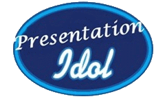

::: image-right

:::

In a couple of weeks, I‘m participating in an internal “Presentation
Idol”competition. It’s a contest of presentation skills against
impressive competition (I can’t name names, but rest assured it’s a
strong group) being judged by Microsoft executives (again, I can’t name
names, but this time it’s because I don’t know who’s judging) in front
of what I assume will be a large technical internal Microsoft audience.
To top it off, we each only get three minutes and thirty three seconds
each to deliver our presentations.

So yeah, no pressure.

The topic we’re all presenting is “What is the one thing we should do to
improve Microsoft?” For those who know me, it should come as little
surprise that I picked a variant of “more open source” for my
presentation. More specifically, I’m planning to present the following:

1.  Any product Microsoft gives away for free should also be Open
    Source.
2.  Open Source Microsoft products should accept contributions from the
    community.

I realize that many people consider this separation between “source
availability” and “community contributions” completely artificial. Sure,
the [accepted definition of Open Source](http://opensource.org/docs/osd)
only addresses the availability and distribution of source code, but
most Open Source advocates consider the ability to collaborate and
contribute – what Wikipedia calls “[Commons-based peer
production](http://en.wikipedia.org/wiki/Commons-based_peer_production)”
– a critical aspect of Open Source. For example, with respect to the
[announcement](http://weblogs.asp.net/scottgu/archive/2009/04/01/asp-net-mvc-1-0.aspx)
that ASP.NET MVC would be released under the
[Ms-PL](http://opensource.org/licenses/ms-pl.html), Keith Elder
[tweeted](http://twitter.com/keithelder/status/1438253992):

> “Giving someone your source code is NOT open source. So although
> Asp.Net MVC’s source code is out there for download, not open source.”

::: image-right
 
:::

In what now seems like a huge coincidence, Keith and his co-host [Chris
“Woody” Woodruff](http://twitter.com/cwoodruff) interviewed me later
that day for their podcast [Deep Fried
Bytes](http://deepfriedbytes.com/). As you might imagine, while we
started with [talking about
IronPython](http://deepfriedbytes.com/podcast/episode-31-being-dynamic-about-ironpython-with-harry-pierson-ndash-part-1/),
we eventually started discussing [open source at
Microsoft](http://deepfriedbytes.com/podcast/episode-32-being-dynamic-about-ironpython-with-harry-pierson-ndash-part-2/)
more generally. It was a great conversation, and we found lots of common
ground.

Personally, I think Microsoft is making small steps in the right
direction when it comes to Open Source. Not only have some high profile
Microsoft projects go Open Source like ASP.NET MVC and
[MEF](http://codebetter.com/blogs/glenn.block/archive/2008/10/02/mef-going-ms-pl-the-little-engine-that-could.aspx),
but we’ve even started taking baby steps for including external
intellectual property. Releasing ASP.NET MVC under Ms-PL is a big deal,
but I think [including jQuery “in the
box”](http://weblogs.asp.net/scottgu/archive/2008/09/28/jquery-and-microsoft.aspx)
is a much, *much* bigger deal. It remains to be seen if it’s a
one-time-only deal or if it’s a new trend inside Microsoft.

Obviously, I hope it’s a trend. Going from “include jQuery in ASP.NET”
to “accept community contributions in ASP.NET” seems like a relatively
achievable goal.

Now, here’s where I need **your** help.

I can easily fill three and a half minutes talking about Open Source
community collaboration. But since my presentation is about taking
contributions from the community, I decided to put my money where my
mouth is and crowdsource it:

**What is the elevator pitch \*you\*
would make for including community contributions in Microsoft Open
Source products?**

Leave me a comment, send me an email, tweet it, whatever – I’ll be
keeping an eye out for responses. Please remember that I only have three
and a half minutes to present, so keep your ideas short and sweet.
