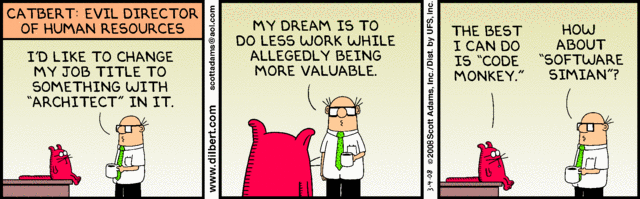

Since it’s apparently Architecture Week^tm^ [^1] here at DevHawk, here’s
another of my favorite Dilbert cartoons of all time – relevant to the
discussion at hand.

Two interesting
[comments](http://devhawk.net/CommentView,guid,94b98f0d-d884-4557-8df0-8f0dca3b72e7.aspx#commentstart)
on yesterday’s post:

> Architectural thinking is a necessary (and very important) part of
> software development – but beyond the systems level (which is systems
> administration and not software architecture) I have a hard time
> seeing divorcing architectural thinking from the actual development as
> anything but a terrible thing. Although I see that your definition of
> architecture (at the functional level) does not match my caricature of
> the ‘architecture astronauts’ which I do think can be endemic in
> languages that encourage additional layers of architecture.\ 
> [[Michael Foord](http://www.voidspace.org.uk/)]

> So based on the definition of architecture I’m reading into your post,
> you wouldn’t consider the choice of object-oriented versus functional
> programming styles from an architectural perspective? I’m trying to
> understand what level of architecture you mean here. Like Michael, I
> usually think of architecture even down into the implementation
> patterns level (hence the architecture astronauts), but that seems to
> be included in what you might be calling an engineering concern.\
> [[Ryan Riley](http://wizardsofsmart.net/)]

Let me be very clear. Using my definition, there is no such thing
“architecture even down into the implementation patterns level”. I’d
argue that the implementation patterns level is engineering, not
architecture. From what I’ve seen, the terms “architecture” and
“engineering” tend to be used interchangeably in the software industry,
and frankly I think that’s a mistake. I said as much in [yet another
post](http://devhawk.net/2005/08/30/architecture-at-the-intersection/)
I wrote four years ago:

> Architecture is the intersection between business and IT.
>
> If a decision doesn’t effect a business person, it’s not an
> architecture decision. I’m not saying it’s not important – I think the
> role of the software engineer is critical in large-scale enterprise
> system design and construction. And I will readily admit that often a
> single person is responsible for both architecture and engineering.
> But that doesn’t make them the same activity. As long as we continue
> to confuse the two disciplines, we hold them both back.

Michael and Ryan (or anyone else for that matter) are welcome to
disagree with my definition of architecture. I often joke that if you
asked ten architects to define “architecture”, you’d get twelve answers.
But that’s my definition and I’m sticking to it.

But what of the Architecture Astronauts? Both Michael and Ryan mentioned
them. Unsurprisingly, I think that term is used too broadly as well. If
you go back and read Joel’s [original
post](http://www.joelonsoftware.com/articles/fog0000000018.html) of
Architecture Astronauts, there wasn’t much reference, if any, to the
implementation layer at all.

> The Architecture Astronauts will say things like: “Can you imagine a
> program *like* Napster where you can download *anything,* not just
> songs?” Then they’ll build applications like Groove that they think
> are *more* general than Napster, but which seem to have neglected that
> wee little feature that lets you type the name of a song and then
> listen to it — the feature we wanted in the first place. Talk about
> missing the point. If Napster *wasn’t* peer-to-peer but it *did* let
> you type the name of a song and then listen to it, it would have been
> just as popular.\
> [Joel on Software, [Don’t Let Architecture Astronauts Scare
> You](http://www.joelonsoftware.com/articles/fog0000000018.html)]

I feel that my definition fits very well with the way Joel writes about
architecture in this paragraph. The Architect Astronaut is trying to
solve a real business problem – people need access to information
besides music. But the mistake they make is thinking they can solve
multiple problems with a single solution. So they abstract higher and
higher until they’ve lost sight of the original problem and can only
focus on the abstractions. If you look at what Joel has to say about
technologies like Hailstorm and Jini, you see the same pattern emerge.

This isn’t to say that similar problems of over-abstraction don’t happen
at the implementation layer – they do. But they happen for very
different reasons. Astronaut Architects are trying to solve multiple
problems with a single solution. But when over-abstraction happens at
the implementation level, it because someone thought they could predict
the future.

We’ve all seen our fair share of over-engineered systems that introduce
significant unneeded complexity on the off chance that the development
team can successfully predict the kind of change likely to come in the
next version of the product. Invariably, the team’s precognitive
abilities are revealed to be as poor as everyone else’s, so they’re left
with a bunch of extra layers of software cruft that has to be maintained
but provides zero additional value to the system. I’ve blogged about
that problem before as well: [Kitchen Sink
Variability](http://devhawk.net/2008/03/04/kitchen-sink-variability/).

Since I’m big on keeping the terminology of architecture and engineering
separate, then I’d argue that we need a different term than Architecture
Astronaut for people who want to introduce additional layers of
abstraction at the implementation layer on the off chance that they
don’t suck at precognition. Since we call such systems over-engineered,
wouldn’t that make the people who build them “Over Engineers”?

[^1]: It’s like [Shark Week](http://en.wikipedia.org/wiki/Shark_Week), but
with white boards and even more terrifying.
