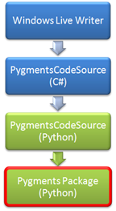

::: image-left
[](compilepython-image_1.png)
:::

In looking at my [hybrid IronPython / C\# Windows Live Writer
plugin](http://devhawk.net/2009/08/10/building-a-hybrid-c-ironpython-app-without-dynamic-type/),
we’re going to start at the bottom with the Pygments package. Typically
Python packages are a physical on-disk folder that contain a collection
of Python files (aka modules). And during early development of Pygments
for WLWriter, that’s exactly how I used it. However, when it can time
for deployment, I figured it would be much easier if I packaged up the
[Pygments
package](http://github.com/devhawk/pygments.wlwriter/tree/2c9cbb7f777d66d5ad615bb71201dc6c181ef18e/pygments_package/pygments),
[my custom HTML
formatter](http://github.com/devhawk/pygments.wlwriter/blob/2c9cbb7f777d66d5ad615bb71201dc6c181ef18e/pygments_package/devhawk_formatter.py)
and the [standard library modules that Pygments depends
on](http://github.com/devhawk/pygments.wlwriter/tree/2c9cbb7f777d66d5ad615bb71201dc6c181ef18e/pygments_package/pygments_dependencies)
into a single assembly.

IronPython ships with a script named
[pyc](http://ironpython.codeplex.com/SourceControl/changeset/view/57861#758946)
for compiling Python files into .NET assemblies. However, pyc is pretty
much just a wrapper around the clr module CompileModules function. I
wrote my [own custom
script](http://github.com/devhawk/pygments.wlwriter/blob/2c9cbb7f777d66d5ad615bb71201dc6c181ef18e/pygments_package/build_pygments.py)
to build the Pygments assembly from the files in a the pygments and
pygments\_dependencies folders.

``` python
from System import IO
from System.IO.Path import Combine

def walk(folder):
  for file in IO.Directory.GetFiles(folder):
    yield file
  for folder in IO.Directory.GetDirectories(folder):
    for file in walk(folder): yield file

folder = IO.Path.GetDirectoryName(__file__)

pygments_files = list(walk(Combine(folder, 'pygments')))
pygments_dependencies = list(walk(Combine(folder,'pygments_dependencies')))

all_files = pygments_files + pygments_dependencies
all_files.append(IO.Path.Combine(folder, 'devhawk_formatter.py'))

import clr
clr.CompileModules(Combine(folder, "..externalpygments.dll"), *all_files)
```

Most of this code is a custom implementation of
[walk](http://docs.python.org/library/os.html#os.walk). I have all the
[IronPython and DLR
dlls](http://github.com/devhawk/pygments.wlwriter/tree/2c9cbb7f777d66d5ad615bb71201dc6c181ef18e/External)
including ipy.exe checked into my source tree, but I don’t have the
standard library checked in. Other than that, the code is pretty
straight forward – collect a bunch of files in a list and call
CompileModules.

The problem with this approach is that IronPython isn’t doing any kind
of dependency checking when we compile the assembly. If you pass just
the contents of the Pygments package into CompileModules, it will emit
an assembly but that assembly will still depend on some modules in the
standard library. If those aren’t available, the Pygments assembly won’t
load. I’d *love* to have an automatic tool to determine module
dependencies, but since I didn’t have such a tool I used a brute-force,
by-hand solution. I wrote a [small
script](http://github.com/devhawk/pygments.wlwriter/blob/2c9cbb7f777d66d5ad615bb71201dc6c181ef18e/External/test_compiled_pygments.py)
to exercise the Pygments assembly. If there were any missing
dependencies, test\_compiled\_pygments would throw an exception
indicating the missing module. For each missing dependency, I copied
over the missing dependency, recompiled to project and tried again.
Lather, rinse, repeat. Not fun, but Pygments only depended on seven
standard library modules so it didn’t end up taking that long.

So having gone down this path of compiling Python files into an
assembly, would I do it again? For an application with an installer like
this one, yes no question. I added the Pygments assembly as a reference
to my C\# library and it got added to the installer automatically. That
was much easier than managing all of the Pygments files and its
dependencies in the installer project manually. Plus, I still would have
had to manually figure out the dependencies unless I chose to include
the entire standard library.

I will point out that the compiled Pygments assembly is the largest
single file in my deployed solution. It clocks in at 2.25MB. That’s
about twice the size of the Python files that I compiled it from. So
clearly, I’m paying for the convenience of deploying a single file in
space and maybe load time. [^1] I’m also paying in space for a private
copy of IronPython and the DLR – the two IronPython and five DLR
assemblies clock in around 3.16MB. In comparison, the actual Writer
plugin assembly itself is only about 25KB! But for an installed desktop
app like a WLWriter plugin, 5MB of assorted infrastructure isn’t worth
worrying about compared to the hassle of ensuring a shared copy of
IronPython is installed. I mean, even if you don’t know IronPython
exists, you can still install and use Pygments for WLWriter. Simplifying
the install process is easily worth 5MB in storage space on the user’s
computer in my opinion.

Next up, we’ll look at the Python half of the PygmentsCodeSource
component, which calls into this compiled Pygments library.

[^1]: I haven’t done it, but it would be interesting to compare the load
time for the single larger pygments assembly vs. loading and parsing the
Python files individually. If I had to guess, I’m thinking the single
assembly would load faster even though it’s bigger since there’s less
overhead (only loading one big file vs. lots of small ones) and you skip
the parsing step. But that’s pure guesswork on my part.
