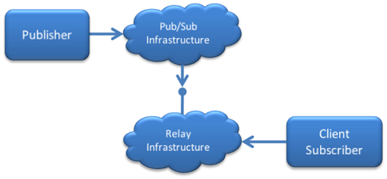

[Christian Weyer](http://blogs.thinktecture.com/cweyer) makes a [great
comment](http://devhawk.net/CommentView,guid,ebed9385-833f-4ef9-8a32-931162f742a1.aspx#commentstart)
on [yesterday’s
post](http://devhawk.net/2009/08/26/async-messaging-and-the-barbarian-hordes/)
about the barbarian rediscovery of async messaging:

> But how do these two toolkits solve the NAT/Firewall issue? Without a
> solution to this they are pretty much useless in breadth usage.

Simply put, they don’t. Frankly, they don’t even try. And I agree with
Christian that the NAT/Firewall issue makes any async messaging based
approach useless for clients. It’s kind of like the [last mile
problem](http://en.wikipedia.org/wiki/Last_mile) in the telco/cable
industries – you’ve got this great capability in the center, but you
can’t leverage its full potential because of the massive effort it takes
to push that capability all the way to the edge of the network.

Dave Winer has been [pretty
explicit](http://www.scripting.com/stories/2009/07/17/thisIsNotAnEarthshakingAnn.html)
with his RSS Cloud work: “The goal is to have a *Small Pieces Loosely
Joined* equivalent of Twitter.” PubSubHubbub doesn’t mention Twitter by
name, but the [protocol
spec](http://pubsubhubbub.googlecode.com/svn/trunk/pubsubhubbub-core-0.1.html)
specifically says “Polling sucks. We think a decentralized pubsub layer
is a fundamental, missing layer in the Internet architecture today”.
Both specs have a fundamental design that looks like this:

This picture leaves out multiple publishers and subscribers and the
subscriber registration process, but you get the basic idea. And it all
works great *assuming* that both the subscriber and the pub/sub
infrastructure can accept incoming connections. While that seems like a
fairly safe assumption for infrastructure pieces, it is clearly a faulty
assumption for any subscriber running locally on a client machine.
Client machines primarily live behind firewalls at the office, behind
NAT routers at home or on mobile wireless network – all of which
disallow most if not all incoming connections. In other words, this
works just fine for server subscribers (like, say Google Reader) but not
for client subscribers (like, say TweetDeck).

As far as I can tell, the only way to enable client subscribers to play
in this async messaging world is via some type of relay service. Any
other solution I can think of depends on mass adoption of new
technology, which as I mentioned in my last post is nearly impossible.

In this approach, the client subscriber makes an outbound connection to
some type of relay infrastructure, which in turn creates a endpoint on
the public internet for that client. Registration for pub/sub happens as
normal, using the relay endpoint as the notification URL. Then, when a
message arrives on the relay endpoint, it’s sent back down the outbound
connection to the client.

The relay approach is technically feasible – it’s used in many places
today. [Exchange
DirectPush](http://technet.microsoft.com/en-us/library/aa997252.aspx)
uses this approach to support real-time delivery of mail to mobile
devices – though the relay capability is built directly Exchange client
access servers rather than available as a separate service. The [.NET
Service Bus](http://www.microsoft.com/azure/servicebus.mspx) – part of
[Windows Azure](http://www.microsoft.com/azure) – provides a hosted
relay infrastructure that anyone can leverage (though their support of
non-windows platforms is pretty weak). I haven’t worked with it, but it
looks like [Opera’s new Unite
platform](http://dev.opera.com/articles/view/opera-unite-developer-primer/)
includes a relay service as well (note, they call it a proxy service).
Nice thing about Opera Unite is the async messaging infrastructure is
built right into their browser, though you could achieve something
similar in any browser using
[Flash](http://livedocs.adobe.com/flash/9.0/ActionScriptLangRefV3/flash/net/Socket.html)
or
[Silverlight](http://msdn.microsoft.com/en-us/library/cc296248(VS.95).aspx).

Yes, having to relay messages sucks. But the question is, which sucks
worse: polling or relaying?
