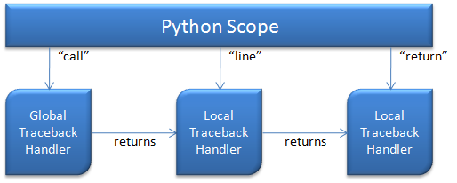

Now that I’ve introduced my [simple hybrid GetThings
app](http://devhawk.net/2009/10/06/lightweight-debugging-for-hybrid-cironpython-apps/),
we need to set about adding support for debugging just the IronPython
part of the app via the new lightweight debugging functionality we’re
introducing in 2.6. Note, the code is [up on
github](http://github.com/devhawk/LightweightDebuggerDemo), but isn’t
going to exactly match what I show on the blog. Also, I have a post RC1
daily build of IronPython in the [Externals
folder](http://github.com/devhawk/LightweightDebuggerDemo/tree/deac85aaf14b37352ce4248917fd857c173d8997/External)
since I discovered a few issues while building this sample that Dino had
to fix after RC1. Those assemblies will be updated as needed as the
sample progresses.

We saw last time how how easy it is to execute a Python script to
configure a C\# app – only four lines of code. If we want to support
debugging, we need to add a fifth:

``` csharp
private void Window_Loaded(object sender, RoutedEventArgs e)
{
    ScriptEngine engine = Python.CreateEngine();
    engine.SetTrace(this.OnTraceback);

    ScriptScope s = engine.CreateScope();
    s.SetVariable("items", lbThings.Items);
    engine.ExecuteFile("getthings.py", s);
}
```

You’ll notice the one new line – the call to engine.SetTrace. This is
actually an extension method – ScriptEngine is a DLR hosting API class
and but SetTrace is IronPython specific functionality [^1]. If you look
at the source of Python.SetTrace, you’ll see that it’s just a wrapper
around SysModule.settrace, but it avoids needing to get the engine’s
shared PythonContext yourself.

SetTrace takes a TracebackDelegate as a parameter. That delegate gets
registered as the global traceback handler for the Python engine (on
that thread, but we’ll ignore threading for now). Whenever that engine
enters a new scope (i.e. a new function), the IronPython runtime calls
into the global traceback handler. While the traceback handler runs,
execution of the python code in that engine is paused. When the
traceback handler returns, the engine resumes executing python code.

In addition to the global traceback handler, each scope has a local
traceback handler as well. The TracebackDelegate type returns a
TracebackDelegate which is used as the local traceback handler for the
next traceback event within that scope. Traceback handlers can return
themselves, some other TracebackDelegate, or null if they don’t want any
more traceback events for the current scope. It’s kinda confusing, so
here’s a picture:



You’ll notice three different traceback event types in the picture
above: call, line and return. Call indicates the start of a scope, and
is always invoked on the global traceback handler (i.e. the traceback
passed to SetTrace). Line indicates the Python engine is about to
execute a line of code and return indicates the end of a scopes
execution. As you can see, the runtime uses the return value of the
traceback for the next tracing call until the end of the scope. The
return value from the “return” event handler is ignored.

So now that we know the basics of traceback handlers, here’s a simple
TracebackDelegate that simply returns itself. The “Hello, world!” of
traceback debugging if you will.

``` csharp
private TracebackDelegate OnTraceback
    (TraceBackFrame frame, string result, object payload)
{
    return this.OnTraceback;
}
```

If you run this code, there will be no functional difference from the
code before you added the SetTrace call. That’s because we’re not doing
anything in the traceback handler. But if you run this in the debugger
with a breakpoint on this function, you’ll see that it gets called a
bunch of times. In the python code [from the last
post](http://devhawk.net/2009/10/06/lightweight-debugging-for-hybrid-cironpython-apps/),
there are three scopes – module scope, download\_stuff function scope
and the get\_nodes function scope. Each of those function scopes will
have a call and return event, plus a bunch of line events in between.

The parameters for TracebackDelegate are described [in the Python
docs](http://docs.python.org/library/sys.html#sys.settrace). The frame
parameter is the current stack frame – it has information about the
local and global variables, the code object currently executing, the
line number being executed and a pointer to the previous stack frame if
there is one. More information on code and frame objects is available in
the [python data
model](http://docs.python.org/reference/datamodel.html#the-standard-type-hierarchy)
(look for “internal types”). Result is the reason why the traceback
function is being called (in Python docs, it’s called “event” but that’s
a keyword in C\#). IronPython supports four traceback results: “call”,
“line” and “return” as described above plus “exception” when an
exception is thrown. Finally, the payload value’s meaning depends on the
traceback result. For call and line, payload is null. For return,
payload is the value being returned from the function. For exception,
the payload is information about the exception and where it was thrown.

As I mentioned above, python code execution is paused while the
traceback handler executes and then continues when the traceback handler
returns. That means you need to block in that function if you want to
let the user interact with the debugger. For a console app like PDB, you
can do that with a single thread of execution easily enough. For a GUI
app like GetThings, that means running the debugger and debugee windows
on separate threads. And as I alluded to, tracing for Python script
engines is per thread. So next time, we’ll look deeper into how to use
multiple threads for lightweight debugging a hybrid app.

[^1]: Eventually, I’d like to see IronRuby support lightweight debugging
as well. However, there’s no built in mechanism for Ruby debugging the
way there is for Python, so it’s less clear how we should expose
debugging to the Ruby developer. We’d also want to build a language
neutral DLR Hosting API mechanism for lightweight debugging as well at
that point. But honestly, we have higher priorities at this point.
